
<b>Learning Azure Data Factory the Hard Way:  </b>

<i>Using a SQL Server Stored Procedure as a Data Factory Copy Activity Sink</i>

<i>Creating a Slowly Changing Dimension Type 4 using SQL Server Temporal Tables</i>

<u>The problem:</u>
I have a source system holding the names of employees.  I'd like to use this as the source for my data warehouse's Employee dimension.  The source holds only the current state of an Employee, with no history.  My business requirements say that I have to capture any changes to an Employee record as a Slowly Changing Dimension Type 4. (See https://en.wikipedia.org/wiki/Slowly_changing_dimension).

<u>The Context:</u>
I created a solution that gives you a quick but complete Slowly Changing Dimension Type 4 implementation, even where the source system doesn't keep history.  From implementation date forward, the source can be polled and the target updated with change history stored in a separate table.

Along the way, I learned something very important about Azure Data Factory.  I can't find this behavior documented anywhere, so I'm going to provide step-by-step instructions on how to demonstrate the behavior.

All source documents are provided in order to allow you to reproduce my results.  You can follow along with me, step by step.  <b>THIS WILL INCUR AZURE UTILIZATION CHARGES.</b>

I've kept this demonstration as lean as possible in order to keep associated costs to a minimum.  You can run this in an Azure subscription provided through Visual Studio subscribers https://azure.microsoft.com/en-us/pricing/member-offers/credit-for-visual-studio-subscribers/ or use the Azure Free Account and get $200 credit and 12 months of free services https://azure.microsoft.com/en-us/free/.

What are the costs?  

In this demo, I create two Azure SQL Servers (no cost) each hosting an Azure SQL Database (cost).  One is designated the source, the other, the sink.  Both are Basic tier Single Databases deployed to the East US region.  If I leave the databases deployed they will cost me $9.79 per month.  I give you a cleanup script that will drop all of the Azure resources deployed with this demo.  I regularly deploy this demo, work with it, then drop it, keeping my Azure charges to a minimum ($0.0067 per hour).

I'm an old database and data warehouse guy, so I'm very comfortable with using SQL Server as a data source, data sink or source of compute resources.  In this demo, the source and the sink are both instances of Azure SQL Database.  For the sake of the behavior I'll demonstrate, the source really doesn't matter.  The behavior I'll demonstrate will show what happens when you use a SQL Server Stored Procedure as a Copy Activity sink in an Azure Data Factory pipeline.

I've provided PowerShell scripts, Azure Resource Manager templates and Azure Resource Manager parameter files that will allow you to quickly and easily deploy all the resources you will need to demonstrate the behavior.

<b><u>Files:</u></b>
<li>0000_DeployTargetResourceGroup.ps1
<li>0010_DeploySourceAndTargetDatabase.json
<li>0010_DeploySourceAndTargetDatabase.ps1
<li>0020_DeploySourceDatabaseObjects.sql
<li>0030_DeployTargetDatabaseObjects.sql
<li>0035_CreateDataFactory.json
<li>0035_CreateDataFactory.ps1
<li>0040_DeployDataFactory.json
<li>0040_DeployDataFactory.parameters.json
<li>0040_DeployDataFactory.ps1
<li>9999_RemoveTargetResourceGroup.ps1

<u>0000_DeployTargetResourceGroup.ps1</u>
<li>Prompts you for the name of the Azure Subscription you will be using
<li>Prompts you for the name of the Azure Resource Group where all associated resources will be deployed
<li>Prompts you for the location where the Resource Group and all associated resources will be deployed

<u>0010_DeploySourceAndTargetDatabase.json</u>
Azure Resource Manager template that creates the following Azure resources:
<li>Azure SQL Server (source server)
<li>Azure SQL Database (SourceDatabase)
<li>Azure SQL Server (target server)
<li>Azure SQL Database (TargetDatabase)
<li>Azure SQL Database Admin Account (demoadmin)

In order to keep costs to a minimum, the source and sink databases are both hosted in the same region.  The names of the source server and target server have to be globally unique, so I generate guids as the server names.  When this template is successfully deployed, it will output the connection strings to both databases

<u>0010_DeploySourceAndTargetDatabase.ps1</u>
Powershell script that deploys the ARM template 0010_DeploySourceAndTargetDatabase.json.

<u>0020_DeploySourceDatabaseObjects.sql</u>
Creates the source database objects we will require.  These are:
<li>TABLE:  dbo.Employees
<li>DATA:   100 rows of sample data.

100 rows of data should be enough to test if this works.  <i>These are famous last words</i>.  But read on:

<u>0030_DeployTargetDatabaseObjects.sql</u>
Creates the target database objects will will require.  These are:
<li>SCHEMA: Audit - holds operational data
<li>SCHEMA: dim - holds dimension tables
<li>TABLE:  Audit.OperationsEventLog - holds runtime logging data
<li>TABLE:  dim.Employee, dim.Employee_History - holds latest and historical values for Employees
<li>PROC:   Audit.InsertOperationsEventLog - logs runtime logging data 
<li>PROC:   dim.Load_Employee - merges supplied data into dim.Employee

<u>0035_CreateDataFactory.json</u>
Azure Resource Manager template that creates the Data Factory that will copy the data from source and merge the data to the target.

<u>0035_CreateDataFactory.ps1</u>
PowerShell script that deploys an empty data factory to the chosen resource group.

<u>0040_DeployDataFactory.json</u>
Azure Resource Manager template that populates the Data Factory with the Connections, Datasets and Pipelines that will copy data from source to target.

<u>0040_DeployDataFactory.ps1</u>  
PowerShell script that deploys the ARM template 0040_DeployDataFactory.json

<u>9999_RemoveTargetResourceGroup.ps1</u>
Drops the Resource Group created by 0000_DeployTargetResourceGroup.ps1

Notice that dim.Employee is a temporal table, a feature introduced in SQL Server 2016.  This feature is also supported in Azure SQL Database.  See https://docs.microsoft.com/en-us/sql/relational-databases/tables/temporal-tables?view=sql-server-2017

Setting up dim.Employee as a temporal table means the latest state of an Employee is to be held in the table dim.Employee.  Detected change history will be automatically kept in the table dim.Employee_History.

Data will be loaded into dim.Employee using an Azure Data Factory pipeline.  The pipeline will use a Copy Activity where the source is the source system and the sink is a SQL Server stored procedure (dim.Load_Employee) that MERGEs the supplied data into dim.Employee.  Any changes are automatically recorded in dim.Employee_History, as is the nature of Temporal Tables.

I'm using a stored procedure as the data sink so we can process the supplied data using a single MERGE statement.  Existing Employees will be updated, Employees supplied by the source that don't exist in dim.Employees are inserted and Employees that have been deleted from the source are also deleted from the dimension table.  A record of its existence will remain in dim.Employee_History.  See https://docs.microsoft.com/en-us/azure/data-factory/connector-sql-server#invoke-a-stored-procedure-from-a-sql-sink for details on using a stored procedure in a SQL Server sink in the Copy activity.

If you are following along, I'm working in Visual Studio Code with the following extensions:
<li>Azure Resource Manager Tools
<li>PowerShell
<li>SQL Server (mssql)

Also required are PowerShell 5.1 and the PowerShell Az module (https://docs.microsoft.com/en-us/powershell/azure/new-azureps-module-az?view=azps-2.6.0)

// in reality, all connection strings, usernames, passwords and credentials should be stored in Azure Key Vault, but I'm leaving them in cleartext in the parameter files for the educational value and clarity.  To use references to Azure Key Vault secrets from within the parameter file, see https://docs.microsoft.com/en-us/azure/azure-resource-manager/resource-manager-keyvault-parameter

// database firewall rules are intentionally wide-open.  I don't know your external IP address and don't want to walk you through configuring the firewall.  That would not add value to the exercise.  But in a production environment, the firewall should be configured so that only authorized IP addresses can connect to the databases.  <b>DO NOT DEPLOY THIS TO PRODUCTION OR USE THE DATABASES TO STORE PRODUCTION DATA</b>

// in reality, one would not connect to an instance of SQL Database using the administrators account.  The use of a least-priv-user in each database would be more appropriate.

// <b>DO NOT DEPLOY THIS TO PRODUCTION OR USE THE DATABASES TO STORE PRODUCTION DATA</b>

<b>Deploying the solution:</b>

In Visual Studio Code open the folder holding the code.

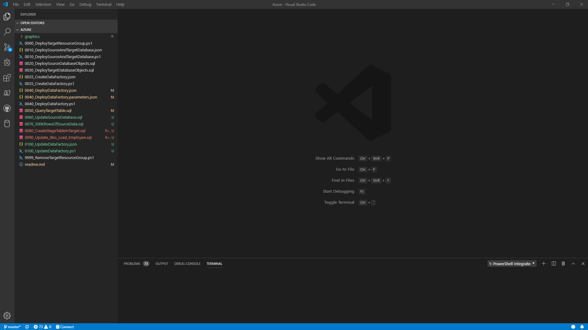

We're going to deploy the resource group that will hold all of our Azure resources. You will need the following information:
<li>The name of the Azure subscription you will be deploying to (I use "Marc Jellinek - Visual Studio Enterprise")
<li>The name of the resource group you will be deploying to (I use "AzDataFactoryDemo_SqlSpSink" - must be a NEW resource group, do not use an existing resource group)
<li>The name of the location you will be deploying to (I use eastus)

Open the file 0000_DeployTargetResourceGroup.ps1

Fill in the values for $subscriptionName, $resourceGroupName and $location.

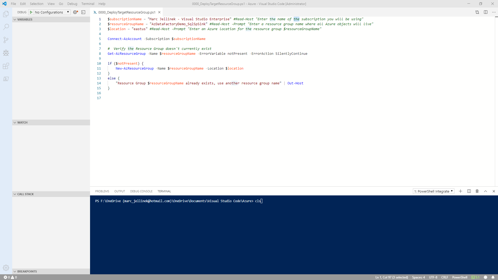

Hit F5 to run.  The script will ask you to log into your Azure account, then create a new resource group with the name you gave. 

If you use the name of a resource group that already exists, the script will tell you.  You must use a new resource group, do not use an existing one.  The cleanup script deletes the resource group you provide and we don't want any accidental deletions!

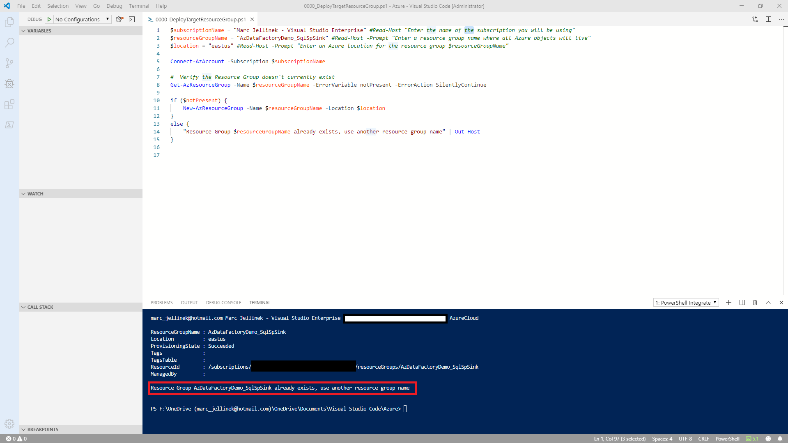

Log into the Azure Portal at https://portal.azure.com, select Resource Groups (on the left side), filter based on your resource group name and confirm that it was created.

Our next step is to deploy the source and target database servers and databases.  Open the file 0010_DeploySourceAndTargetDatabase.ps1 and hit F5.  This will deploy the ARM template stored in 0010_DeploySourceAndTargetDatabase.json.

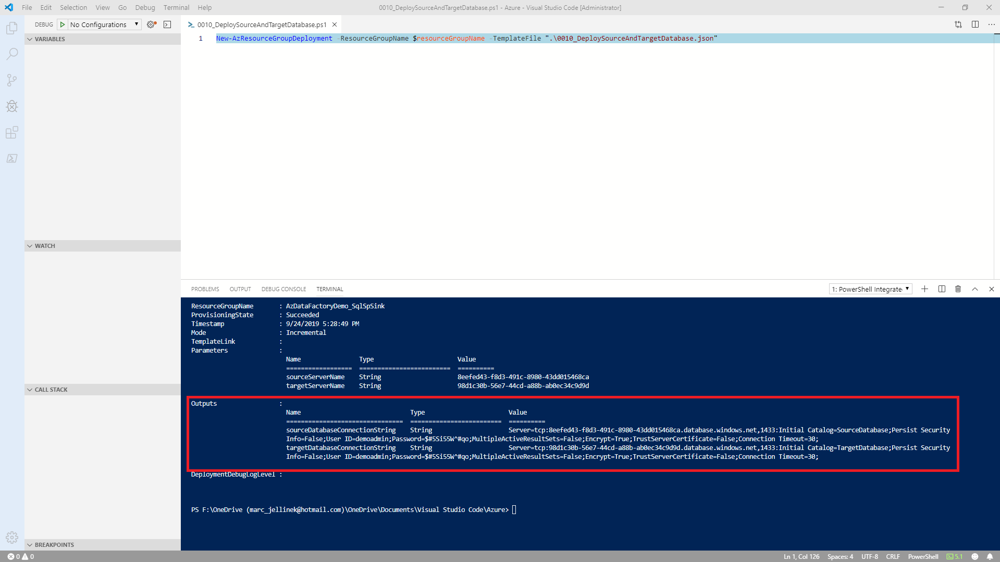

This takes a bit of time, so be patient.  When the template is deployed, it will tell you the connection strings for your source and target databases.  Notice that the server names for the deployed Azure SQL Servers are named as GUIDs.  These are generated as part of the deployment.  The server names must be globally unique.  Copy-and-paste these somewhere, we're going to need them later.

When this is complete, go into the Azure Portal, select your resource group and look at the resources it contains.  It should look like this (your server names will be different, but they should be named as guids).

The next part is to set up database connections to the source and target databases so we can deploy database objects.

From within Visual Studio Code, open the file 0020_DeploySourceDatabaseObjects.sql
From within Visual Studio Code, hit F1 and type 'mssql' and select MS SQL: Connect.

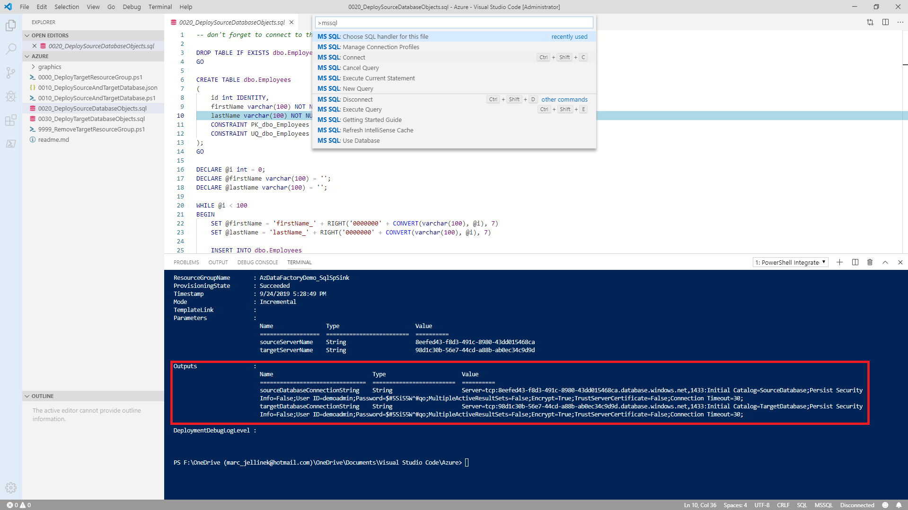

Copy-and-paste the sourceDatabaseConnectionString output by 0010_DeploySourceAndTargetDatabase.json.

Give the connection a profile name of "AzureDataFactoryDemo_SqlSpSink_SourceDatabase".

You can now run the script against the Source Database by hitting Ctrl-Shift-E.  This will create a table called dbo.Employees and populate it with 100 rows of sample data.  This is confirmed for you with the last line of the script.  You should see this as the result:

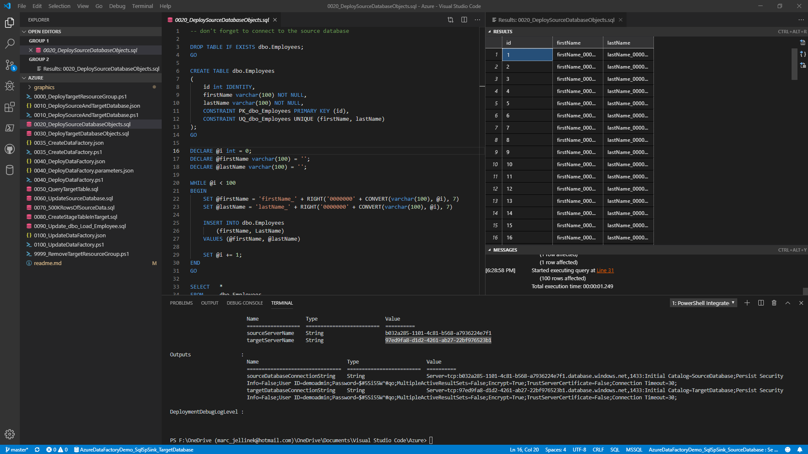

Open the file 0030_DeployTargetDatabaseObjects.sql and connect to the target database.  Name the connection profile AzureDataFactoryDemo_SqlSpSink_TargetDatabase and run the script.  Your results will be this:

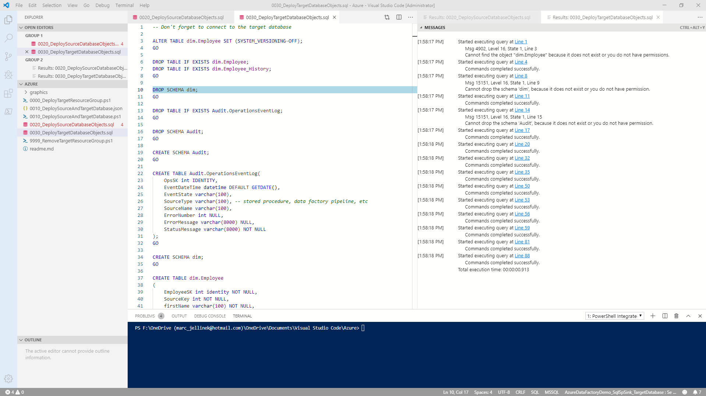

Don't worry if there are errors like "Cannot find the object dim.Employee" or "Cannot drop the schema 'Audit'".  The script was meant to be run multiple times, so there is code that drops existing objects then re-creates them.  This is not a concern.

If you'd like to pause at this point to confirm the database objects have been created, open up SQL Server Management Studio or the client of your choice and connect to the source and target databases.

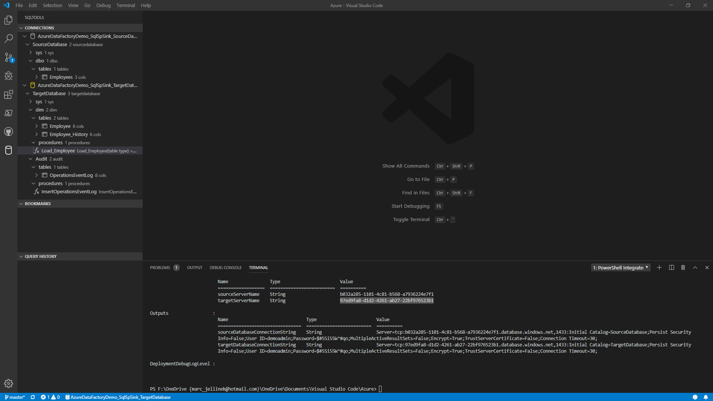

Our last deployment step is to create the Data Factory that will copy data from our source database and merge it into our target database.  Open the file 0035_CreateDataFactory.ps1 and hit F5.

Go back into the Azure Portal, select your resource group and hit refresh.  You should see the data factory named AzureDataFactoryDemo-SqlSpSink-Data-Factory

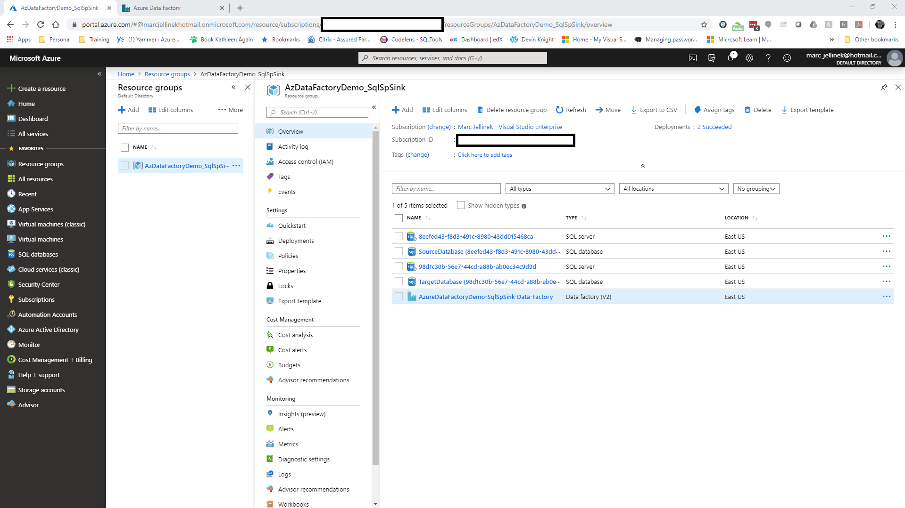

In the Azure Portal, click on the Data Factory, then click on Author & Monitor.  When creating a new Data Factory, the first time I go into Author & Monitor, I'll see "Loading..." for a bit.  If you see "Loading..." for more than a few minutes, log out of all your Azure accounts (I often run multiple simultaneously) and log back in using only your the account that has access to your Azure subscription.  That often clears up the problem.  You should see a Data Factory that has no Connections, no Datasets and no Pipelines.  Click on the Pencil in the upper left of the screen:

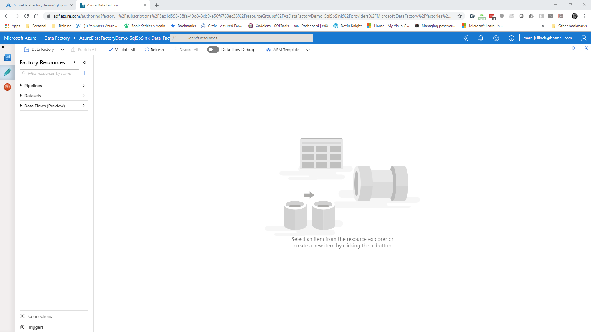

Now that we've created the Data Factory, we will populate it with all the elements required to pull data from the source database and merge it into the destination database.

We're going to have to tell the data factory the server names for the target and source database.  We're going to do this by editing the parameters file associated with the data factory pipeline deployment.  Remember I asked you to copy-and-paste the output connection strings when the databases were created?  You are going to need them now.

Open the file 0040_DeployDataFactory.parameters.json.  Edit the SourceDatabase_connectionString and TargetDatabase_connectionString.  You only have to edit the portion {servername}.  These will allow the data factory to connect to the source and target databases we created earlier.  

// In the real world, connection strings, usernames, passwords and other credentials would be securely stored in Azure Key Vault, then referenced by the parameter file.

Make sure you save the parameters file.  Now open 0040_DeployDataFactory.ps1 and hit F5 to run it.

When it completes, go back to the Data Factory and click refresh.

You will see two datasets and one pipeline

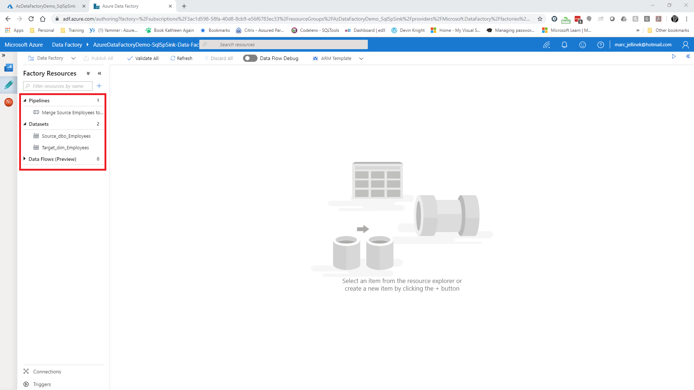

Now before we move on, let's take stock of where we are:

<li>Our source data is 100 records of test data in our source database in a table dbo.Employee
<li>Our target database has a stored proc that merges supplied data into a dimension table dim.Employee.  
<li>Our target database keeps the current Employee record in dim.Employee and keeps track of previous versions of an Employee in dbo.Employee_History
<li>We are starting with our target database empty
<li>Data Factory and SQL Server operations are logged to a table in the Target database called Audit.OperationsEventLog

Go back to the Data Factory portal and open up the pipeline "Merge Source Employees to Target Employee".  Click on the Debug button

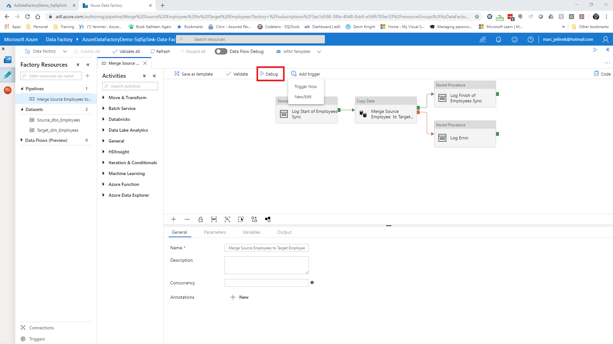

After a few minutes or so, this is what you will see:

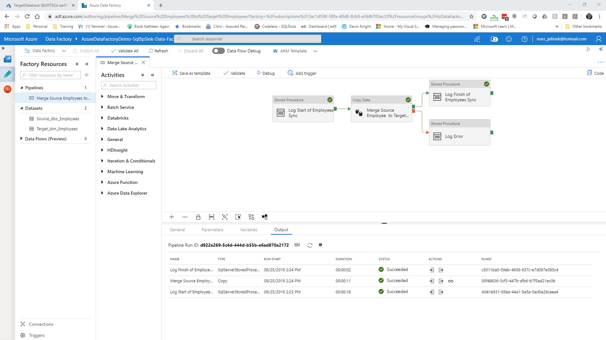

Let's query the target database and see what landed.

Go back into Visual Studio Code and open 0050_QueryTargetTable.sql.  Connect to the target database and run the query using Ctrl-Alt-E.  You will see this:

The first resultset shows 100 Employee, 0 rows in Employee_History and 4 entries in the operations event log.

From the operations event log, we see that the pipeline "Merge Source Employees to Target Employees" (OpsSK=1) successfully called the stored procedure [dim].[Load_Employee] supplying 100 rows of data to be processed (OpsSK=2).  We see that the stored procedure [dim].[Load_Employee] completed without error (OpsSK=3) and returned control to the data factory pipeline (OpsSK=4).

I expect that I should have 100 rows in dim.Employee, and I do.  The data appears valid with unique first and last names.

Now let's test out the Slowly Changing Dimension Type 4 (wow, that sounds so official!) functionality by modifying data in the source database.  Open up file 0060_UpdateSourceDatabase.sql.  We will

<li>Delete the row with the id=33
<li>Add a new row (id=101)
<li>Update the row with the id=66

Just hit Ctrl-Alt-E to execute.

Go back to the data factory pipeline and kick off the pipeline using the Debug button.  When the pipeline completes successfully, go back into Visual Studio Code.

Go back to the file 0050_QueryTargetTable.sql and re-run the query using Ctrl-Alt-E.

In dim.Employee, confirm there is no row with id=33.
Confirm the row with id=66 has their firstName and lastName values updated.
Confirm the new row with id=101 appears in dim.Employee
Confirm the row with id=33 appears in dim.Employee_History
Confirm the row with id=66 appears in dim.Employee_History

So far, everything looks good.  So I deployed my code to my test environment and tested it against live source data.

#THIS IS WHERE IT ALL WENT WRONG

When run against live source data with 1,000,000 rows, I was only seeing 20,000 rows in dim.Employee.  Where did all the other rows go?  This was blocking my fellow developers and needed to be fixed fast.

I got a clue when I looked at the operations event log.

We can duplicate this problem by adding 1,000,000 rows to our source data.  Open up 0060_1MRowsOfSourceData.sql and execute. This is going to take a while, especially on a Basic-tier database.  Go get coffee, do yoga, play with a dog or do something nice for someone.  It'll be done when you get back.  I want to let the suspense build.

Besides, this is a good place to pitch the scalability, both up and down, of Azure SQL Database.  If we were in the Standard or Premium tiers, we'd be able to scale up to a more performant (actually less restricted) option within the Service Tier, say from an S0 to an S12, while we're inputting all this data.  When loading is complete, drop back down to an S0.  An S0 costs $0.202 per hour, an S12 costs $6 per hour (https://azure.microsoft.com/en-us/pricing/details/sql-database/single/).  This is an attractive option when hit with one-time events like large data loads.

In the Data Factory portal, execute the pipeline again. This will merge over the rows that were inserted into source.  This will also take a while.  This is a good place to pause.

Now let's see:
XX rows in dim.Employee - I expect to have 1,000,000 rows
YY rows in dim.Employee_History - That can't be right
ZZ rows in Audit.OperationsEventLog

Here's the key giveaway:

The good news is that MERGing into a temporal table is a good way to generate SCD4 dimension tables.  That part works!  Hooray for us!

Go back to Visual Studio Code and open 

What was going on?  Rather than supplying all the source data in dbo.Load_Employee, the stored procedure was called multiple times with batches of the source data.  The way the MERGE was written (look inside dbo.Load_Employee or in file 0030_DeployTargetDatabaseObjects.sql), if a row exists in the target, but does not exists in the source, that row is deleted from the target.  Since there were lots of rows that didn't exist in what the stored proc saw as the source, it deleted rows in the target.

The parallel calls to dbo.Load_Employee with batches of source data makes sense when its understood that Data Factory is based on Azure Databricks, a Spark-based analytics platform.  Data Factory generates Scala which is executed on Databricks.  Spark's key strength is the ability to scale out compute as needed, then execute in parallel.  smh.  Duh.  

That's where I found out that the solution I came up with wouldn't work.

When I tested things out using a 50-row source table, the rowcount or dataload or whatever was small enough that it fit into one batch.  At some point between 100 and 1,000,000 a threshhold was crossed and Data Factory started breaking up the source data into batches of approximately 20,000 rows (batches is probably the wrong word) for parallel load and execution.

I can't find this behavior documented anywhere.  There is an explicit warning that invoking a stored procedure processes the data row by row instead of by using a bulk operation, which they don't recommend for large-scale copy.  Maybe this behavior is what they meant by "row by row"? https://docs.microsoft.com/en-us/azure/data-factory/connector-sql-server#invoke-a-stored-procedure-from-a-sql-sink

This is not a bug.  We want Data Factory to run things in parallel.  This is the stubbed toe.  This is the mistake you only make once.  This is one that you remember.  This is learning Azure Data Factory the Hard Way.

So what was the solution to my problem?  I did a quick pivot, went heads down and recoded a truncate/reload solution and got my fellow developers unblocked.  We've all been there.  

We maintained a stage table that held data from the source table.  The source table and the stage table were kept in sync by TRUNCATE and reload process that ran prior to the merge.  This allowed the data loading part of the process to run in parallel.  After data loading completed, we then ran a MERGE against the stage table and dim.Employee.  This allowed us to capture changes in values from day-to-day in the history table enabled by working with a complete dataset.

A bonus, the truncate/reload process was actually much faster than importing through a stored procedure sink.

The key takeaways:
Log Everything
Examine your logs
Love your testers (who were the ones who actually caught the problem)
When something doens't work, fix it
It's a parallel-cloud-in-memory-Spark-inspired-source-of-compute world out there.