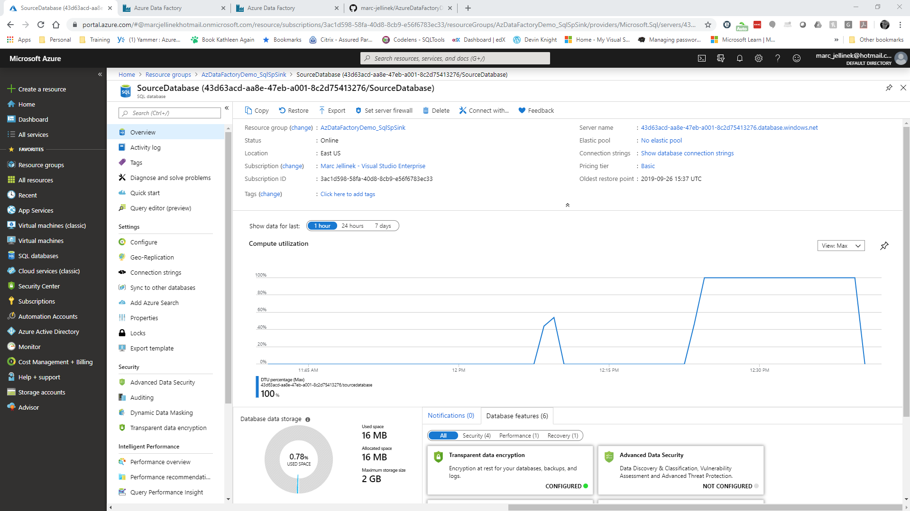
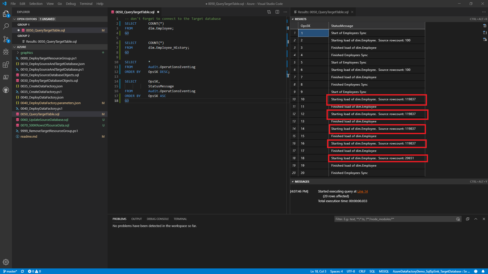

<b>Learning Azure Data Factory the Hard Way:  </b>

<i>Using a SQL Server Stored Procedure as a Data Factory Copy Activity Sink</i>

<i>Creating a Slowly Changing Dimension Type 4 using SQL Server Temporal Tables</i>

<u>The problem:</u>
I have a source system holding the names of employees.  I'd like to use this as the source for my data warehouse's Employee dimension.  The source holds only the current state of an Employee, with no history.  My business requirements say that I have to capture any changes to an Employee record as a Slowly Changing Dimension Type 4. (See https://en.wikipedia.org/wiki/Slowly_changing_dimension).

<u>The Context:</u>
I created a solution that gives you a quick but complete Slowly Changing Dimension Type 4 implementation, without relying on the source system keep history.  From implementation date forward, the source can be polled and the target updated with change history stored in a separate table.

Along the way, I learned something very important about Azure Data Factory.  I can't find this behavior documented anywhere, so I'm going to provide step-by-step instructions on how to demonstrate the behavior.

All source documents are provided in order to allow you to reproduce my results.  You can follow along with me, step by step.  <b>THIS WILL INCUR AZURE UTILIZATION CHARGES.</b>

I've kept this demonstration as lean as possible in order to keep associated costs to a minimum.  You can run this in an Azure subscription provided through Visual Studio subscriptions https://azure.microsoft.com/en-us/pricing/member-offers/credit-for-visual-studio-subscribers/ or use the Azure Free Account and get $200 credit and 12 months of free services https://azure.microsoft.com/en-us/free/.

<u>What are the costs?</u>

In this demo, I create an Azure Resource Group (no cost), two Azure SQL Servers (no cost) each hosting an Azure SQL Database (cost).  Each database is hosted on its own server.  One database is designated the source, the other, the sink or target.  Both are Standard tier Single Databases S0 SKU deployed to the East US region  You can deploy to any region that supports Azure SQL Database  https://azure.microsoft.com/en-us/global-infrastructure/services/?products=sql-database.  

If I leave the databases deployed they will cost me $0.02 per hour each.  I give you a cleanup script that will drop all of the Azure resources deployed with this demo.  I regularly deploy this demo, work with it, then drop it, keeping my Azure charges to a minimum.

There is also an Azure Data Factory.  You pay for Data Factory by the thousands of activity runs times the number of Data Integration Unit-hours times $0.25.  I don't know what a Data Integration Unit is, but you can find out how many your pipeline consumed by looking at Copy Activity DIU Consumed.

The last time I ran the merge pipeline, it consumed 4 Data Integration Units (see Copy Activity's .output.usedDataIntegrationUnits) and ran for 188 seconds (.output.copyDuration).  From this information we can calculate our charges.  188 seconds is 0.052 of an hour.  4 DIU * 0.052 * $0.25 = $0.052.  If I interpret that correctly, I get 1000 activity runs for $0.052.  

In this demo, the source and the sink are both instances of Azure SQL Database.  For the sake of the behavior I'll demonstrate, the source really doesn't matter.  It could have been a CSV file in Azure Blob Storage or a json file in Azure Data Lake.  The behavior I'll demonstrate will show what happens when you use a SQL Server Stored Procedure as a Copy Activity sink in an Azure Data Factory pipeline.

This applies to Azure SQL Database as well as the SQL Server products.  I believe, but have not tested, that this applies to using a stored procedure against databases other than SQL Server.  What we are demonstrating is the behavior of the Azure Data Factory Copy Activity, not the activity of an particular persistence store.

I've provided PowerShell scripts, SQL scripts, Azure Resource Manager templates and Azure Resource Manager parameter files that will allow you to quickly and easily deploy all the resources you will need to demonstrate the behavior.

<b><u>Files:</u></b>
<li>0000_DeployTargetResourceGroup.ps1
<li>0010_DeploySourceAndTargetDatabase.json
<li>0010_DeploySourceAndTargetDatabase.ps1
<li>0020_DeploySourceDatabaseObjects.sql
<li>0030_DeployTargetDatabaseObjects.sql
<li>0035_CreateDataFactory.json
<li>0035_CreateDataFactory.ps1
<li>0040_DeployDataFactory.json
<li>0040_DeployDataFactory.parameters.json
<li>0040_DeployDataFactory.ps1
<li>0050_QueryTargetTables.sql
<li>0060_UpdateSourceDatabase.sql
<li>0070_500KRowsOfSourceData.sql
<li>0080_CreateStageTableInTarget.sql
<li>0090_Update_dbo_Load_Employees.sql
<li>0100_UpdateDataFactory.json
<li>0100_UpdateDataFactory.ps1
<li>9998_ScaleDownSourceAndTargetDatabases.ps1
<li>9999_RemoveTargetResourceGroup.ps1

Data will be loaded into dim.Employee in the target database using an Azure Data Factory pipeline.  The pipeline will use a Copy Activity where the source is the source database and the sink is a SQL Server stored procedure (dim.Load_Employee) that MERGEs the supplied data into dim.Employee on the target database.  Any changes are automatically recorded in dim.Employee_History, as is the nature of Temporal Tables.

If you want to follow along, I'm working in Visual Studio Code with the following extensions:
<li>Azure Resource Manager Tools
<li>PowerShell
<li>SQL Server (mssql)
<li>SQLTools

Also required are PowerShell 5.1 and the PowerShell Az module (https://docs.microsoft.com/en-us/powershell/azure/new-azureps-module-az?view=azps-2.6.0)

This demonstration should work across Windows, Linux and MacOS.  Please use a supported browser (https://docs.microsoft.com/en-us/azure/azure-portal/azure-portal-supported-browsers-devices) to access the Azure portal.

// in reality, all connection strings, usernames, passwords and credentials should be stored in Azure Key Vault, but I'm leaving them in cleartext in the parameter files for the educational value and clarity.  To use references to Azure Key Vault secrets from within the parameter file, see https://docs.microsoft.com/en-us/azure/azure-resource-manager/resource-manager-keyvault-parameter

// database firewall rules are intentionally wide-open.  I don't know your external IP address and don't want to walk you through configuring the firewall.  That would not add value to the exercise.  But in a production environment, the firewall should be configured so that only authorized IP addresses can connect to the databases.  <b>DO NOT DEPLOY THIS TO PRODUCTION OR USE THE DATABASES TO STORE PRODUCTION DATA</b>

// in reality, one would not connect to an instance of SQL Database using the administrators account.  The use of a least-priv-user in each database would be more appropriate.

// <b>DO NOT DEPLOY THIS TO PRODUCTION OR USE THE DATABASES TO STORE PRODUCTION DATA</b>

<b>Deploying the solution:</b>

In Visual Studio Code open the folder holding the code.

We're going to deploy the resource group that will hold all of our Azure resources. You will need the following information:
<li>The name of the Azure subscription you will be deploying to (I use "Free Trial")
<li>The name of the new resource group you will be deploying to (I use "AzDataFactoryDemo_SqlSpSink") - must be a NEW resource group, do not use an existing resource group
<li>The name of the location you will be deploying to (I use eastus).  Use a region closest to you for the most responsive experience.

Open the file 0000_DeployTargetResourceGroup.ps1

Fill in the values for $subscriptionName, $resourceGroupName and $location.

Hit F5 to run.  The script will ask you to log into your Azure account, then create a new resource group with the name you gave.  Sometimes the login prompt for Azure hides behind another window.  If you don't see the login prompt, minimize active windows until you see it. 

If you use the name of a resource group that already exists, the script will tell you.  You must use a new resource group, do not use an existing one.  The cleanup script deletes the resource group you provide and we don't want any accidental deletions!

Log into the Azure Portal at https://portal.azure.com, select Resource Groups (on the left side), filter based on your resource group name and confirm that it was created.

Our next step is to deploy the source and target database servers and databases, as well as an empty instance of Azure Data Factory.  Open the file 0010_DeploySourceAndTargetDatabase.ps1 and hit F5.  This will deploy the ARM template stored in 0010_DeploySourceAndTargetDatabase.json.  This takes a bit of time, so be patient.  When I deploy this, it usually takes less than 5 minutes.

When the template is deployed, it will tell you the connection strings for your source and target databases.  Notice that the server names for the deployed Azure SQL Servers are named as GUIDs.  These are generated as part of the deployment.  The server names must be globally unique.  Copy-and-paste these somewhere, we're going to need them later.

When this is complete, go into the Azure Portal, select your resource group and look at the resources it contains.  It should look like this (your server names will be different, but they should be named as guids).

The next part is to set up database connections within Visual Studio Code to the source and target databases so we can deploy database objects.

From within Visual Studio Code, open the file 0020_DeploySourceDatabaseObjects.sql
From within Visual Studio Code, hit F1 and type 'mssql' and select MS SQL: Connect.

Copy-and-paste the sourceDatabaseServerName as output by 0010_DeploySourceAndTargetDatabase.json and append ".database.windows.net".

Give the connection a profile name of "AzureDataFactoryDemo_SqlSpSink_SourceDatabase".

You can now run the script against the Source Database by hitting Ctrl-Shift-E.  This will create a table called dbo.Employees and populate it with 100 rows of sample data.  This is confirmed for you with the last line of the script.  You should see this as the result:

Open the file 0030_DeployTargetDatabaseObjects.sql and connect to the target database.  Name the connection profile AzureDataFactoryDemo_SqlSpSink_TargetDatabase and run the script.  Your results will be this:

Don't worry if there are errors like "Cannot find the object dim.Employee" or "Cannot drop the schema 'Audit'".  The script was meant to be run multiple times, so there is code that drops existing objects then re-creates them.  This is not a concern.

If you'd like to pause at this point to confirm the database objects have been created, open up SQL Server Management Studio, Azure Data Studio or the client of your choice and connect to the source and target databases.

I'm using the SQLTools Visual Studio Code Add-in.  Click on the database icon on the lefthand column of the window.

Notice that the target database's dim.Employee is a temporal table, a feature introduced in SQL Server 2016.  This feature is also supported in Azure SQL Database.  See https://docs.microsoft.com/en-us/sql/relational-databases/tables/temporal-tables?view=sql-server-2017

Setting up dim.Employee as a temporal table means the latest state of an Employee is to be held in the table dim.Employee.  Detected change history will be automatically kept in the table dim.Employee_History.

I'm using a stored procedure as the data sink so we can process the supplied data using a single MERGE statement.  Existing Employees will be updated, Employees supplied by the source that don't exist in dim.Employees are inserted and Employees that have been deleted from the source are also deleted from the dimension table.  A record of its existence will remain in dim.Employee_History.  See https://docs.microsoft.com/en-us/azure/data-factory/connector-sql-server#invoke-a-stored-procedure-from-a-sql-sink for details on using a stored procedure in a SQL Server sink in the Copy activity.

Our last deployment step is to create the Data Factory that will copy data from our source database and merge it into our target database.  

In the Azure Portal, click on the Data Factory, then click on Author & Monitor.  When creating a new Data Factory, the first time I go into Author & Monitor, I'll see "Loading..." for a bit.  If you see "Loading..." for more than a minute or so, log out of all your Azure accounts.  I'm often logged in to multiple accounts simultaneously, usually my personal account, my employer's account and my customer's account.  This includes logins to outlook.com (my personal email) and portal.office.com (my employer email and my customer's email).  Log back in using only your the account that has access to your Azure subscription.  That often clears up the problem.  You should see a Data Factory that has no Connections, no Datasets and no Pipelines.  Click on the Pencil in the upper left of the screen:

We will populate the Data Factory with all the elements required to pull data from the source database and merge it into the destination database.

We're going to have to tell the data factory the server names for the target and source database.  Do this by editing the parameters file associated with the data factory pipeline deployment.  Remember I asked you to copy-and-paste the output connection strings when the databases were created?  You are going to need them now.

Open the file 0040_DeployDataFactory.parameters.json.  Edit the SourceDatabase_connectionString and TargetDatabase_connectionString.  You only have to edit the portion {servername}.  These will allow the data factory to connect to the source and target databases we created earlier.  

// In the real world, connection strings, usernames, passwords and other credentials would be securely stored in Azure Key Vault, then referenced by the parameter file.

Make sure you save the parameters file.  Now open 0040_DeployDataFactory.ps1 and hit F5 to run it.

When it completes, go back to the Data Factory and click refresh.  You will see two datasets and one pipeline.

Now before we move on, let's take stock of where we are:

<li>Our source data is 100 records of test data in our source database in a table dbo.Employee
<li>Our target database has a stored proc that merges supplied data into a dimension table dim.Employee.  
<li>Our target database keeps the current Employee record in dim.Employee and keeps track of previous versions of an Employee in dbo.Employee_History
<li>We are starting with our target database empty
<li>Data Factory and SQL Server operations are logged to a table in the Target database called Audit.OperationsEventLog

Go back to the Data Factory portal and open up the pipeline "Merge Source Employees to Target Employee".  Trigger the pipeline by clicking on "Add Trigger", then select "Trigger Now"

Go to the monitor (orange dial below the pencil on the left side) to monitor the progress of the pipeline execution.  After a few minutes or so, this is what you will see:

Let's query the target database and see what landed.

Go back into Visual Studio Code and open 0050_QueryTargetTable.sql.  Connect to the target database and run the query using Ctrl-Alt-E.  You will see this:

The first resultset shows 100 Employees, 0 rows in Employee_History, 100 entries in dim.Employee and 4 entries in the operations event log.

From the operations event log, we see that the pipeline "Merge Source Employees to Target Employees" (OpsSK=1) successfully called the stored procedure [dim].[Load_Employee] supplying 100 rows of data to be processed (OpsSK=2).  We see that the stored procedure [dim].[Load_Employee] completed without error (OpsSK=3) and returned control to the data factory pipeline (OpsSK=4).

I expect that I should have 100 rows in dim.Employee, and I do.  The data appears valid with unique first and last names.

Now let's test out the Slowly Changing Dimension Type 4 (wow, that sounds so official!) functionality by modifying data in the source database.  Open up file 0060_UpdateSourceDatabase.sql and connect to the source database.  We will

<li>Delete the row with the id=33
<li>Add a new row (id=101)
<li>Update the row with the id=66

Just hit Ctrl-Alt-E to execute.

Go back to the data factory pipeline and trigger the pipeline.  When the pipeline completes successfully, go back into Visual Studio Code.

Go back to the file 0050_QueryTargetTable.sql and re-run the query using Ctrl-Alt-E.

<li>Confirm there is no row with id=33 in dim.Employee.
<li>Confirm the row with id=66 has their firstName and lastName values updated.
<li>Confirm the new row with id=101 appears in dim.Employee
<li>Confirm the row with id=33 appears in dim.Employee_History
<li>Confirm the row with id=66 appears in dim.Employee_History

So far, everything looks good.  So I deployed my code to my test environment and tested it against live source data.

#THIS IS WHERE IT ALL WENT WRONG

When run against live source data with 1,000,000 rows, I was only seeing 20,000 rows in dim.Employee.  Where did all the other rows go?  This was blocking my fellow developers and needed to be fixed fast.

I got a clue when I looked at the operations event log.

We can duplicate this problem by adding 500,000 rows to our source data.  Open up 0070_500KRowsOfSourceData.sql and execute. This is going to take a while, especially on a Basic-tier database.  Expect it to run for about 5 minutes.

Do we want to scale up our source and target databases or not?

You have a choice to make.  

A choice based on your personal priorities.  

Or your management's priorities.

Or your CEO's priorities.

This is a simple choice:  do you value money over time or time over money?

If you value money over time, do not run the script that will scale our databases from an S0 to an S12.  You will spend less money but it will take more time.

If you value time over money, run the script that will scale our databases from an S0 to an S12.  You will spend less time, but spend more money.

The choice is yours.

If you are using a free Azure subscription or a subscription through your Visual Studio subscription, you can get your credit balance here: https://docs.microsoft.com/en-us/azure/billing/billing-mca-check-azure-credits-balance.  
If you are using the Free Trial subscription, you are limited to S1 anyway... it's not worth the time to scale from an S0 to an S1.

But if you have the option of scaling up, see the file "0065_ScaleUpSourceAndTargetDatabases.ps1" and "9998_ScaleDownSourceAndTargetDatabases.ps1"

Back to debugging:  We are going to load 500000 rows of test data into the source database.  Execute 0070_500KRowsOfSourceData.sql

Another good thing to do is show you how to monitor the progress of the script.  Go into the Azure Portal, negotiate to your resource group and click on SourceDatabase.  Give it a few minutes and you'll see DTU utilization pinned at 100%.  This is referred to as throttling, which is generally bad.  I prefer to think of it as I'm using 100% of the capability that I'm paying for.  This means there will be such a load on the SourceDatabase that it may not be responsive to other users of the database.  Consider this when sizing or scaling your production databases.  For the sake of a demo, we're ok.

In the Data Factory portal, execute the pipeline again. This will merge over the rows that were inserted into source.  

When the sync is complete, go back to 0050_QueryTargetTable.sql.  Connect to the target database and execute the script.

<li>Confirm that dim.Employee returns 500000 rows. 
<li>Confirm that dim.Employee_History returns 2 rows (no net-new rows)
<li>Confirm that Audit.OperationsEventLog shows the successful running of the sync process

Now let's see:
20652 rows in dim.Employee - I expect to have 499999 rows
479352 rows in dim.Employee_History - I expect to have 2 rows (no net-new rows)
20 rows in Audit.OperationsEventLog

(these rowcounts are very consistent, something deterministic is going on here.)

Here's the key giveaway: Looking at the OpsSK's values (10, 12, 14, 16, 18) we can see that the stored procedure [dbo].[Load_Employees] was called multiple times, each time supplying approximately 100K rows of data at a time.

What was going on?  Rather than supplying all the source data in dbo.Load_Employee, the stored procedure was called multiple times with batches of the source data.  The way the MERGE was written (look inside dbo.Load_Employee or in file 0030_DeployTargetDatabaseObjects.sql), if a row exists in the target, but does not exists in the source, that row is deleted from the target.  Since there were lots of rows that didn't exist in what the stored proc saw as the source, it deleted rows in the target.

That's where I found out that the solution I came up with wouldn't work.

When I tested things out using a 100-row source table, the rowcount or dataload or whatever was small enough that it fit into one batch.  At some point between 100 and 500,000 rows a threshhold was crossed and Data Factory started breaking up the source data into batches of approximately 100K rows (batches is probably the wrong word) for serial load and execution.

I can't find this behavior documented anywhere.  There is an explicit warning that invoking a stored procedure processes the data row by row instead of by using a bulk operation, which Microsoft doesn't recommend for large-scale copy.  Maybe this behavior is what they meant by "row by row"? https://docs.microsoft.com/en-us/azure/data-factory/connector-sql-server#invoke-a-stored-procedure-from-a-sql-sink

This is not a bug.  This is the stubbed toe.  This is the mistake you only make once.  This is one that you remember.  This is learning Azure Data Factory the Hard Way.

The good news is that MERGing into a temporal table is a good way to generate SCD4 dimension tables.  That part works!  Hooray for us!  We just have to supply the MERGE statement with a complete set of source data.

I did a quick pivot, went heads down and recoded a truncate/reload solution and got my fellow developers unblocked.  We've all been there.  

The solution was to maintain a stage table that holds data from the source table.  The source table and the stage table were kept in sync by TRUNCATE and reload process that runs prior to the merge.  This allows the data loading part of the process to run in parallel.  

After data loading completes, we then run a MERGE against the stage table and dim.Employee.  This allows us to capture changes in values from day-to-day in the history table enabled by working with a complete dataset.  It only required a minor edit of the dbo.Load_Employee stored procedure

So let's finish out a solution that will work over the long term:

We need to accomplish the following tasks:
<li>Create a stage table in the target database that mirrors the structure of the source data
<li>Modify the merge procedure to read from the stage table instead of a passed parameter
<li>Modify the Data Factory to copy from source to stage, then run the merge procedure

Open file and run 0080_CreateStageTableInTarget.sql. This will create the stage table and reinitialize dim.Employee, dim.Employee_History and Audit.OperationsEventLog.

Open file and run 0090_Update_dbo_Load_Employee.sql.  Review the comments for the modifications made.  The primary change is to read from Stage.Employee instead of a passed parameter @Employees.

Open file and run 0100_UpdateDataFactory.ps1.  This will deploy the ARM template 0100_UpdateDataFactory.json.

The following modifications were made to the data factory:
<li>Created dataset Stage_Employees, which points at Stage.Employee within the target database
<li>Modified pipeline Merge Source Employees to Target Employees.  
<li>First calls a Copy Activity that truncates the target and reloads it from the source
<li>After the Copy Activity completes, call the modified stored procedure to merge the data into dim.Employee

After the updated data factory is deployed, go back into the Data Factory Portal.  Click refresh and open the pipeline.  

See how every step is logged to the target database.  This isn't strictly necessary since Azure Data Factory already logs everything it does.  I'm not sure how to get at the logs using the Logs Analytic Workspace, but watch this space.  Azure Data Factory Analytics https://azure.microsoft.com/en-us/blog/monitor-azure-data-factory-pipelines-using-operations-management-suite/

The pipeline now runs a Copy Activity where the source is Source.dbo.Employees and the sink is Target.Stage.Employees.  If you click into the Sink of the copy activity, you'll see that the Pre-Copy Script is a TRUNCATE command.  The copy activity will clean out Stage.Employee then copy the entire contents of Source.dbo.Employees to Target.Stage.Employees.  

After the copy command completes, a Stored Procedure activity runs Target.dbo.Load_Employees, which merges Stage.Employees into dim.Employee.  Since dim.Employee is a temporal table, all changes will be recorded to dim.Employee_History.  This is a simple example of the ELT (Extract Load Transform) design pattern.

This is a good place to stop and take measure of where we are:

<li>There are 500000 rows of data in Source.dbo.Employees
<li>There are zero rows in Target.dim.Employees
<li>There are zero rows in Target.dim.Employees_History
<li>There are zero rows in Target.Audit.OperationsEventLog

Trigger the data factory pipeline "Merge Source Employees to Target Employees".  We expect to wind up with:
<li>500000 rows in Target.dim.Employee
<li>0 rows in Target.dim.Employee_History
<li>6 rows in Target.Audit.OperationsEventLog

Go back to 0050_QueryTargetTable.sql and confirm:
<li>500000 rows in Target.dim.Employee
<li>0 rows in Target.dim.Employee_History
<li>6 rows in Target.Audit.OperationsEventLog

Pay special attention to OpsSK2, where we see that we are dealing with the complete data set.

A bonus, the truncate/reload process was actually much faster than importing through a stored procedure sink.  Faster means money saved.  Executing in half the time means half the cost.  Performance tuning just became a profitable activity.

An last, we are going to confirm our SCD4 functionality by making changes in the source database.  Open file 0010_UpdateSourceDatabaseAgain.sql and run it against the source database.

Trigger the data factory pipeline one last time.

When the pipeline is complete, open 0050_QueryTargetTable.sql

Confirm:
<li>500000 rows in Target.dim.Employee
<li>2 rows in Target.dim.Employee_History (SourceKeys 512, 1024)
<li>6 new rows (12 total) in Target.Audit.OperationsEventLog

We have confirmed that we're working as expected.

Let's compare the approaches of loading SQL Server through a stored procedure sync vs a truncate and reload process:

<li>Both solutions require moving the entire source dataset across a network
<li>Both solutions invoke compute resources (stored proc) on the target database
<li>The stored procedure approach copies data in parallel, moving and processing the data in one step
<li>The stored procedure approach doesn't work with deletes in the source database(additional code would have to be written to handle deletes)
<li>The truncate/reload approach reads data from the source in parallel, writes to stage in parallel and MERGEs stage into the target in a single transaction
<li>The truncate/reload approach writes the entire source data to a local stage table each time the sync is run.  The local stage table acts as a proxy for the source table.  There may be better ways to keep the stage table and the source table in sync (highwater marking, delta loads, trickle feeds, etc)

The key takeaways:
<li>Log Everything
<li>Examine your logs
<li>Do one thing at a time 
<li>Mixing movement with transformation in the stored procedure approach is not as performant as truncate/reload/merge approach
<li>Love your testers (who were the ones who actually caught the problem)
<li>Know when something isn't going to work
<li>Always have a plan B
<li>When something doens't work, fix it
<li>It's a parallel-cloud-in-memory-Spark-inspired-source-of-compute world out there.

What parts of this demo are reusable:
<li>The practice of using ARM templates and ARM parameter files deployed using PowerShell scripts is a sustainable best practice.
<li>The practice of using ARM templates deployed using PowerShell scripts and checking the files into a source control system is a sustainable best practice.

What parts of this demo are NOT reusable:
<li>Do not use an administrative SQL Server authentication account for data movement or data compute.  Instead use a least-priv account (SELECT permissions in the source; SELECT, INSERT, UPDATE, DELETE permissions in the target)
<li>The deployment of Azure SQL Servers and Azure SQL Databases in this demo does not follow best practices.  See https://docs.microsoft.com/en-us/azure/security/fundamentals/database-best-practices
<li>Never deploy a database with wide-open firewall rules unless there is a very compelling reason for doing so.
<li>While the use of ARM parameter files to supply connection strings, usernames, passwords and other credentials is a best practice, these values should not be provided in plaintext.  They would be visible to anyone with access to the source control repository.  Instead use Azure Key Vault to store the sensitive information and reference the Key Vault secrets in the parameter file.

Don't forget to scale down your databases, or just delete the resource group and everything we've deployed goes away.  

Appendix:
Interesting Links:
https://docs.microsoft.com/en-us/sql/relational-databases/databases/tempdb-database?view=sql-server-2017#tempdb-database-in-sql-database

Files Provided by this Demo:

<u>0000_DeployTargetResourceGroup.ps1</u>

<li>Prompts you for the name of the Azure Subscription you will be using
<li>Prompts you for the name of the Azure Resource Group where all associated resources will be deployed
<li>Prompts you for the location where the Resource Group and all associated resources will be deployed

If you find yourself repeatedly tearing down and rebuilding the demo (like I do), just hardcode the values into 0000_DeployTargetResourceGroup.ps1.

<u>0010_DeploySourceAndTargetDatabase.json</u>
Azure Resource Manager template that creates the following Azure resources:
<li>Azure SQL Server (source server)
<li>Azure SQL Database (SourceDatabase)
<li>Azure SQL Server (target server)
<li>Azure SQL Database (TargetDatabase)
<li>Azure SQL Database Admin Account (demoadmin)

In order to keep costs to a minimum, the source and sink databases are both hosted in the same region.  The names of the source server and target server have to be globally unique, so I generate guids as the server names.  When this template is successfully deployed, it will output the connection strings to both databases

<u>0010_DeploySourceAndTargetDatabase.ps1</u>

Powershell script that deploys the ARM template 0010_DeploySourceAndTargetDatabase.json.

<u>0020_DeploySourceDatabaseObjects.sql</u>

Creates the source database objects we will require.  These are:
<li>TABLE:  dbo.Employees
<li>DATA:   100 rows of sample data.

100 rows of data should be enough to test if this works.  <i>These are famous last words</i>.  But read on:

<u>0030_DeployTargetDatabaseObjects.sql</u>

Creates the target database objects will will require.  These are:
<li>SCHEMA: Audit - holds operational data
<li>SCHEMA: dim - holds dimension tables
<li>TABLE:  Audit.OperationsEventLog - holds runtime logging data
<li>TABLE:  dim.Employee, dim.Employee_History - holds latest and historical values for Employees
<li>PROC:   Audit.InsertOperationsEventLog - logs runtime logging data 
<li>PROC:   dim.Load_Employee - merges supplied data into dim.Employee

<u>0035_CreateDataFactory.json</u>

Azure Resource Manager template that creates the Data Factory that will copy the data from source and merge the data to the target.

<u>0035_CreateDataFactory.ps1</u>

PowerShell script that deploys an empty data factory to the chosen resource group.

<u>0040_DeployDataFactory.json</u>

Azure Resource Manager template that populates the Data Factory with the Connections, Datasets and Pipelines that will copy data from source to target.

<u>0040_DeployDataFactory.ps1</u>  

PowerShell script that deploys the ARM template 0040_DeployDataFactory.json

<u>0050_QueryTargetTables.sql</u>

Simple query against the target database for looking at dim.Employee, dim.Employee_History and Audit.OperationsEventLog

<u>0060_UpdateSourceDatabase.sql</u>

Generated changes in the source that we will look for in the target

<u>0070_500KRowsOfSourceData</u>

Generates 500K rows of source data

<u>0080_CreateStageTableInTarget.sql</u>

Creates Stage table Stage.Employee
Reinitializes dim.Employee, dim.Employee_History, Audit.OperationsEventLog

<u>0090_Update_dbo_Load_Employees.sql</u>

ALERTS the stored procedure dbo.Load_Employee to merge from Stage.Employees to dim.Employee

<u>0100_UpdateDataFactory.json</u>

ARM Template for updating the data factory pipeline to copy from source to stage, then merge from stage to dimension

<li>0100_UpdateDataFactory.ps1

PowerShell script that deploys the ARM template stored in 0100_UpdateDataFactory.json

<u>9999_RemoveTargetResourceGroup.ps1</u>

Drops the Resource Group created by 0000_DeployTargetResourceGroup.ps1
